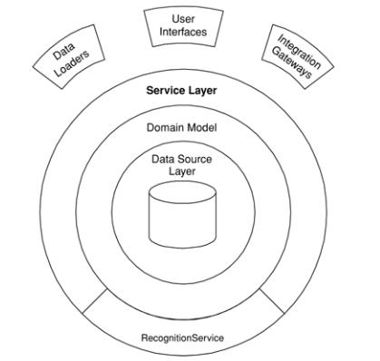
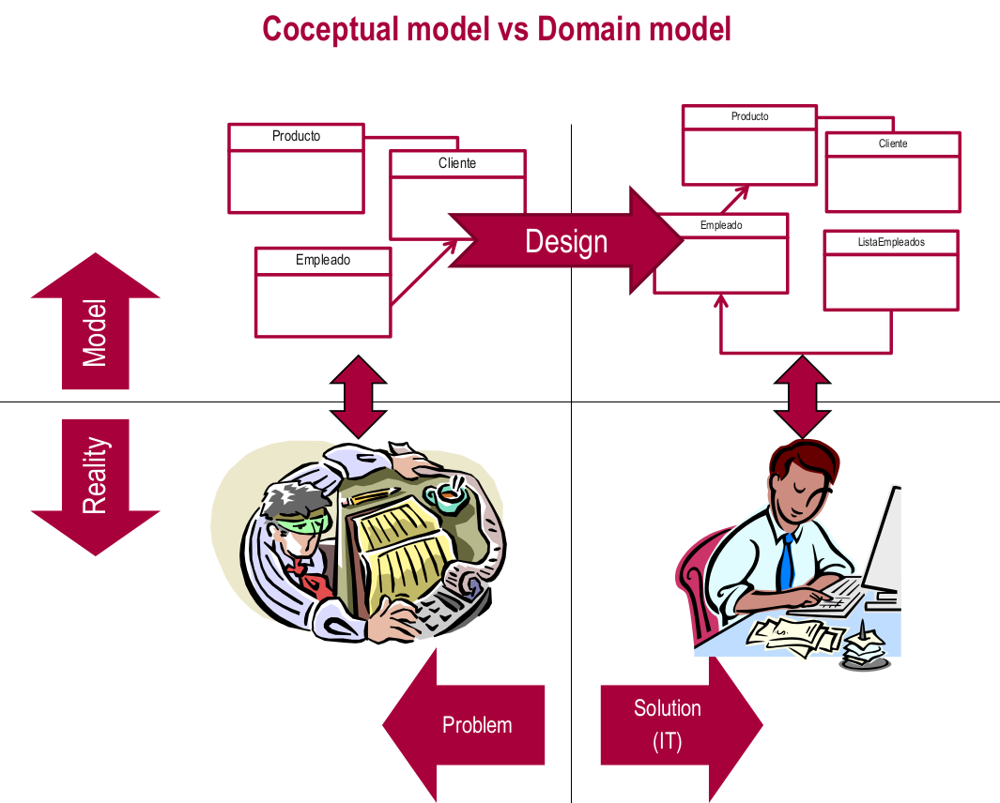

# T4 – Introduction to data model design
## Organizing the business layer

### Patterns

**Transaction script**: Each procedure handles a single request from the presentation.

* Useful for simple logic
* Easy to implement transaction
* Hard to maintain.

**Table module**: A single instance that handles the business logic for all rows in a
database table.

**Domain model** (Used 99% of the time): An object model of the domain that incorporates both behavior
and data.

**Service layer**: Defines an application’s boundary with a layer of services that establishes a set of available operations and coordinates the application’s response in each operation.

### Revisiting conceptual models

When comparing conceptual and domain models, they are represented using the same “language” (UML), but **they mean different things**. Not all boxed at necessarily mapped to a class.

### Conceptual model

We represent **concepts** and their relationships. It is closer to the client's requirements.

- Attribute multiplicity.
- Type of the attribute only if It is a "custom" data type
- Derived attributes
- Generalization/Specialization
- Associations, aggregations and composition.
- Associations class
- Constraints and business rules in UML notes.

### Domain model

We represent **classes, implementation**. It is closer to technology.

Every **conceptual model class is mapped to a domain model class**, there are two types of them:

- **Entities**: They have identity
- **Value objects (datatypes)**: They don't have identity, they are immutable. It is a "wrapper" for plain data.

### Creating domain models from conceptual models

### Services

You create **one service class per entity or group of strongly related entities**.

**The methods of each service class are determined by the functional requirements** (use cases/user stories) of our application.

Presentation, Controller <----> **Services** <----> Domain model 

## Organizing the resource layer

### Patterns

Nowadays, this decision largely depends on the facilities provided by the technology used.

**Active Record**: An object that wraps a row in a database table or view, encapsulates the database access, and adds domain logic on that data.

(**_Meta_) Data Mapper**: Used in this project An object that moves data between objects and a database while keeping them independent of each other and the mapper itself. **In our case, we’ll use (Meta) Data Mapper**.

### Tools/Frameworks

* Persistence frameworks
* JPA: Java Persistence API
* Spring Framework
* Spring Data

### Object Relational Mapping

#### Layer Supertype

It is usual to create **a common abstract class for all entities that contains the identity field**.

If you have more than one kind of object in a layer, it’s useful to have more than one Layer Supertype.

### Data Mapper (Entity Manager)

By default all **tables and fields are mapped with the name of the entity** and attributes, but **we can override that** with annotations `@Table` and `@Column`. This is relevant because **sometimes the name of the attribute could be a reserved** word in SQL.

To map value objects we use the `@Embeddable` annotation. This will **insert the additional columns to entity's table** that make use of the datatype.

### Repositories

