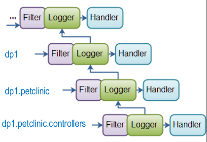
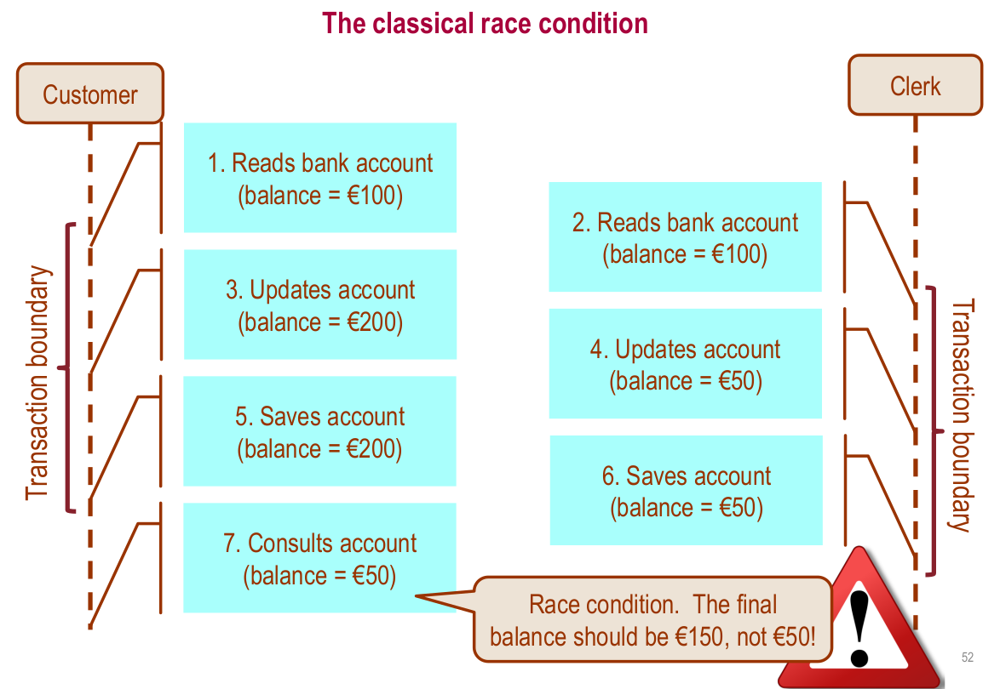
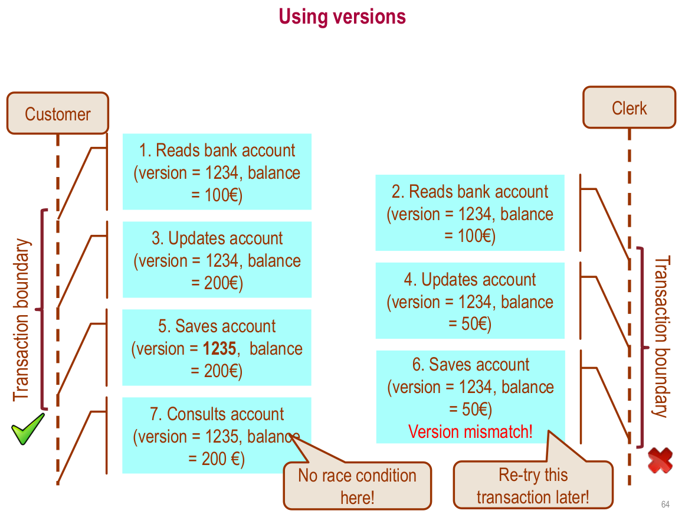
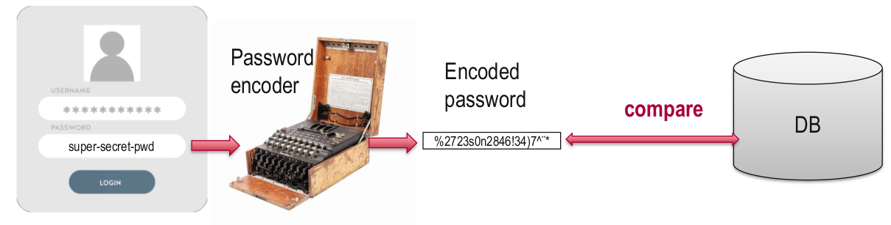

# T11 Design for traceability, reliability, and security

You have learned how to design and tests software, creating cohesive and loosely coupled components.

## Software traceability
We already stablished guidelines on how to develop maintainable and testable software. However, We should also anticipate that our software will fail at some point, for example:
* Unexpected behavior
* Security exploits (Hacking and unauthorized access)
* Unknown bugs
For this reason, It is fundamental to **build mechanisms to trace the source of problems in our software**.

There are two common meanings for the term "Traceability" in software:

Traceability (software engineering): The correspondance between requirements and the different artifact and tasks in the project. This way we make sure that all components of the project are fullfulling an explicit requirement.

Treceability (system behavior): Mechanisms we employ to make sure the software behave as expected. The ability we have to find the source of the problems that might arise.

Some techniques are:
* **Auditing**: Checking that Users and Roles are properly respected so the system forbids or allows certain actions as expected. This is at problem domain level.
* **Logging**: We register the state and behavior of our running software at different points.

### Logging

#### What's a log?
A file that is produced and populated automatically every time a certain level occur in our system.
* Usually time-stamped
* They record **important** (relevant) to keep track of. It can be at any level of the system: OS, Server, Network.

They are **used widely for security, performance or troubleshooting reasons**. They can also be separated depending on their purpose: audit logs, transaction logs, event logs, error logs, messages logs.

#### Log management
Log management is an umbrella term that describes all the activities and processes used to generate _(collect, centralize, parse, transmit, store, archive)_ and dispose of massive volumes of computer-generated log data.

According to Wikipedia, we can divide this field into six segments.
1. **Log collection**: Writing in a file relevant events.
2. Centralized log aggregation
3. Long-term log storage and retention
4. **Log rotation**: When are we removing old log files
5. Log analysis
6. Log search and reporting
_In blacks the segments relevant for DP1_

#### Vanilla Java logging
We usually **create a Logger object** in each class that needs to generate log messages. **This object is typically static and final**, so that all objects in the class use the same instance.

**Each log message that is generated has a level associated** with it,
which expresses the message type or its importance/detail level. Later, we can specify the log level that we want to display.

```java
import java.util.logging.Level;
import java.util.logging.Logger;

public class LoggingExamples {
private static final Logger logger = Logger.getLogger(LoggingExamples.class.getName());
public void doIt() {
	logger.entering(getClass().getName(), "doIt");
	try{
		//... Algo que pueda lanzar una excepción...
	} catch (Exception e) {
		logger.log(Level.SEVERE, "Error doing", e);
	}
		logger.exiting(getClass().getName(), "doIt");
	}
}
```

Log levels defined in the standard java API:
1. SEVERE: Highest level, serious errors/problems.
2. WARNING: Minor errors and important notices.
3. INFO
4. CONFIG
5. FINE
6. FINNER
7. FINEST

**Why use a Logger instead of System.out.println?**
1. Log generation can be easily turn on/off. They can even be filtered by level, package, class, etc.
2. Loggers are much faster (async I/O and multithreading)

#### Logging in Spring Boot
Spring boot supports several logging providers (such as the standard java API) but by default it integrates a logging framework: **Logback** (based on the logging library named _Slf4j_).

**Logback logging levels** can be more meaningful for a spring boot project:
1. ERROR
2. WARN
3. INFO (Default: INFO and above)
4. DEBUG (println substitute)
5. TRACE

##### Logging with Lombok
The annotation `@Slf4j` initializes for us the `Logger` object. It would be equivalent to its explicit declaration:
```java
private static final Logger log = LoggerFactory.getLogger(<YourClass>.class);
```
Then we can make use of the `log` variable. This works in any class we need it.
```java
@Slf4j
@Controller
public class LoggingController {

	@GetMapping(path = "/logging")
	public @ResponseBody String logExamples() {
		log.trace("A TRACE Message");
        log.debug("A DEBUG Message");
        log.info("An INFO Message");
        log.warn("A WARN Message");
        log.error("An ERROR Message");
 
        return "Howdy! Check out the Logs to see the output...";
	}
}
```
#### Hierarchy of Loggers, Filters, and Handlers/Appenders
Loggers follow a hierchy based on the class name where it's used. The class name is the fully qualified name (packages and class).

Logs pass on their messages to their parent recursively.

Additional tools:
* **Filters** determine whether a log message will be displayed or not. A log-level filter is inherited by children unless explicity declaring otherwise.

* **Handler or Appender** determine what will be done with the log entry.

By default a root logger is always created without filters with a handler/appender that generates messages in the system console.
### Configuration

We can configure the default logging level from the spring framework. Also the default loggin level from especific packages.

_application.properties_
```java
logging.level.root=WARN
logging.level.org.springframework.samples.petclinic=DEBUG
```
To perform complex customizations of the logging configuration, the use of a specific configuration file is advised `/src/main/resources/logback.xml`
To see colors on console install the [Eclipse plugin ANSI coloring (mihai-nita.net)](https://www.mihai-nita.net/eclipse)

_/src/main/resources/logback.xml_
```xml
<?xml version="1.0" encoding="UTF-8"?>
<configuration>
    <property name="LOGS" value="./logs" />
    
	<appender name="Console"
        class="ch.qos.logback.core.ConsoleAppender">
        <layout class="ch.qos.logback.classic.PatternLayout">
            <Pattern>
                %black(%d{ISO8601}) %highlight(%-5level) [%blue(%t)] %yellow(%C{1.}): %msg%n%throwable
            </Pattern>
        </layout>
    </appender>
	
    <appender name="RollingFile"
        class="ch.qos.logback.core.rolling.RollingFileAppender">
        <file>${LOGS}/spring-boot-logger.log</file>
        <encoder class="ch.qos.logback.classic.encoder.PatternLayoutEncoder">
            <Pattern>%d %p %C{1.} [%t] %m%n</Pattern>
        </encoder>

        <rollingPolicy class="ch.qos.logback.core.rolling.TimeBasedRollingPolicy">
            <!-- rollover daily and when the file reaches 10 MegaBytes -->
            <fileNamePattern>${LOGS}/archived/spring-boot-logger-%d{yyyy-MM-dd}.%i.log
            </fileNamePattern>
            <timeBasedFileNamingAndTriggeringPolicy
                class="ch.qos.logback.core.rolling.SizeAndTimeBasedFNATP">
                <!-- or whenever the file size reaches 20MB -->
                <maxFileSize>10MB</maxFileSize>
            </timeBasedFileNamingAndTriggeringPolicy>
            	<!-- keep 30 days' worth of history -->
				<maxHistory>30</maxHistory>
        </rollingPolicy>
    </appender>
	
	...
</configuration>
```
More info at [Logback manual](http://logback.qos.ch/manual/index.html):
* [Chapter 4: Appenders](http://logback.qos.ch/manual/appenders.html)
* [Chapter 6: Layouts (Colors)](http://logback.qos.ch/manual/layouts.html)

#### Dinamic logging configuration

Everytime the applications is deployed it also compiles and this is when our logging configuration will take effect. **Is it possible to change the logging configuration on runtime?** Yes, there's an API for it with its HTTP endpoints.

_pom.xml_ (Additional dependency)
```xml
<dependency>
	<groupId>org.springframework.boot</groupId>
	<artifactId>spring-boot-starter-actuator</artifactId>
</dependency>
```

_application.properties_
```java
management.endpoints.web.exposure.include=loggers
management.endpoint.loggers.enabled=true
```
The endpoint is at http://localhost:8080/actuator/loggers/ (Optional: package). **Login with an admin user**.
Nix* command for changing the log level.

```bash
curl -i -X POST
http://localhost:8080/actuator/loggers/<package>
-H 'Content-Type: application/json’
-d '{"configuredLevel": "TRACE"}'
```

We can also use [POSTMAN](https://www.postman.com/) to change this configuration on runtime directly from the browser.

### Auditing

In the context of ORM, database auditing means **tracking and logging events related to persistent entities**, or simply entity versioning.

Auditing is about **recording domain-level events**: a bank transference is created, a user is performing an action, etc. In certain types of applications (such as banking) there is a legal obligation to record such events.

* Auditing information **is usually stored** in the same persistent medium **as the domain model information**, while log files are usually stored externally.
* **Auditing is usually a “feature”** that we include as requirements and can be used by certain roles, through the application user interface.

#### Auditing implications and costs

Each operation implies the creation of one or more audit revisions.

* Slower operations
* A lot of audit data is generated

#### Auditing with Spring Data JPA (not prefered)
Spring Data provides **support to transparently keep track of who created or changed an entity** and the point in time this happened. We need to explicity enable it using `@EnableJpaAuditing` annotation in a configuration class.
```java
@EnableJpaAuditing
@SpringBootApplication
public class PetclinicApplication { ...
}
```
Additionally, we must **enhance our entity classes with auditing metadata**.
```java
@Entity
@EntityListeners(AuditingEntityListener.class)
class Customer {
	@CreatedBy
	private String creator;
	@CreatedDate
	private LocalDateTime createdDate;
	@LastModifiedBy
	private String modifier;
	@LastModifiedDate private LocalDateTime lastModifiedDate;
	// ... further properties omitted
}
```
The support for auditing of Sprind Data JPA has some limitations and drawbacks:
* It requires adding properties to the audited entities. (Solution: Create an `AuditableEntity` which extends from `BaseEntity` with the auditable properties)
* **Lack of support for delete operations**.
* **Lack of support for a full history** of modifications. (Only the last change and creation)
* It keeps **track of modifications on any property** of the entities.
_AuditableEntity class example_
```java
@MappedSuperclass
@EntityListeners(AuditingEntityListener.class)
public class AuditableEntity extends BaseEntity{
	@CreatedBy
	private String creator;
	@CreatedDate
	private LocalDateTime createdDate;
	@LastModifiedBy
	private String modifier;
	@LastModifiedDate
	private LocalDateTime lastModifiedDate;
}
```
All auditable entities should extend from `AuditableEntity`.

```java
@Data @Entity
public class Payment extends AuditableEntity {
    double amount;
    @OneToOne Owner owner;
}
```

We also need a class to retrieve current user information

```java
@Component
public class AuditorAwareImpl implements AuditorAware<String> {
    @Override
    public Optional<String> getCurrentAuditor() {
        Optional<String> currentUserName=Optional.empty();
        Authentication authentication = SecurityContextHolder.
        getContext().getAuthentication();
        
        if (!(authentication instanceof AnonymousAuthenticationToken)) {
            currentUserName=Optional.of(authentication.getName());
        }else if(authentication!=null) {
            currentUserName=Optional.of(authentication.getPrincipal().toString());
        }

        return currentUserName;
        }
}
```

#### Auditing with Hibernate Envers (prefered)

Hibernate provides a module that implements auditing and versioning.

_pom.xml_

```xml
<dependency>
    <groupId>org.hibernate</groupId>
    <artifactId>hibernate-envers</artifactId>
    <version>${hibernate.version}</version>
</dependency>
```

To make an entity auditable we only need to use the `@Audited` annotation.

**For relationships, each of the related entities need to be also `@Audited`**. If not, we need to annotate them with explicitly with `@NotAudited`.

```java
@Audited
@Entity
public class Bill extends BaseEntity{
    @OneToOne
    @NotAudited
    Visit visit;
    //...
}
```

##### User auditing

Hibernate Envers **does not audit user by default**. There's two ways of configuring user auditing:

1: We need a class that extends from `DefaultRevisionEntity` that retrieves user information.

```java
@Entity
@RevisionEntity(UserRevisionListener.class)
public class UserRevEntity extends DefaultRevisionEntity {
    @Column(name = "user")
    private String username;
}
```

2: We setup a listener to populate user information.

```java
@Component
public class UserRevisionListener implements RevisionListener {
    @Override public void newRevision(Object revisionEntity) {
        UserRevEntity revision = (UserRevEntity) revisionEntity;
        String username = "";
        Authentication auth = SecurityContextHolder.getContext().getAuthentication();
       
        Object principal = auth.getPrincipal();
        if (principal != null && principal instanceof UserDetails)
        username = ((UserDetails) principal).getUsername();
        else if (principal != null)
        
        username = principal.toString();
    	revision.setUsername(username); }
}
```

## Software reliability management

**Logging and Auditing are monitoring/traceability mechanisms** that could help us identify problems but **they do not protect us from the threats**.

Threats:

* Unexpected behaviors
* Hacking and unauthorized actions
* Unknown bugs

Reliability is

* Concurrency safety
* Security
* Proper error handling

### Concurrency safety

An application is concurrency-safe/thread-safe if it **behaves correctly** when it is accessed concurrently by multiple users/threads, **regardless of interleaving of the actions** executed by the users/threads.



#### Versioning

The _version_ attribute is initialized to zero when an entity is created and persisted; and it is increased by one every time the entity’s updated in the database.

Each transaction that reads data holds the value of the version of the entity.

Before any update, the property is checked again:

* If the entity had changed during the transaction, the version attribute would have incremented. An `OptimisticLockException` would be thrown in this case.
* Otherwise, the transaction commits the update and increments the version.

The recommended way of handling the described exception is to **retrieve the entity again and retry the update**.



##### Implementing versioning

_src/main/java/org/springframework/samples/petclinic/model/BaseEntity.java_

```java
@MappedSuperclass
public class BaseEntity {
    @Id
    @GeneratedValue(strategy = GenerationType.IDENTITY)
    protected Integer id;
    
    @Version
    private Integer version;
    (...)
}
```

In the _createOrEditForms_ (views)

```jsp
<form:form modelAttribute="pet" class="form-horizontal">
    <input type="hidden" name="id" value="${pet.id}"/>
    <input type="hidden" name="version" value="${pet.version}"/>
```

In the controllers, when editing.

```java
@PostMapping(value = "/pets/{petId}/edit")
public String processUpdateForm(@Valid Pet pet, BindingResult result,
	Owner owner,@PathVariable("petId") int petId, ModelMap model,
	@RequestParam(value = "version", required=false) Integer version) {
    Pet petToUpdate=this.petService.findPetById(petId);
    
    if(petToUpdate.getVersion()!=version) {
    	model.put("message","Concurrent modification of pet! Try again!");
    return initUpdateForm(petId,model);
}
...
```

##### Troubleshooting versioning: UNSAVED TRANSIENT ENTITY error

After including the _version_ attribute we might find **we can no longer update entities defined in `data.sql` file or create new one through the application**. Hibernate throws an an error when we try to do so.

```log
org.hibernate.action.internal.UnresolvedEntityInsertActions [http-nio-8080-exec-6] HHH000437: Attempting to save one or more entities that have a non-nullable association with an unsaved transient entity. The unsaved transient entity must be saved in an operation prior to saving these dependent entities.
```

This is because **entities inserted through the `data.sql` file does not generate _version_ values "automagically"**. When trying to update any entity with `version=null` will result in Hibernate thinking that the entity is not persisted yet, hence the transaction error. **Remember: new entities inserted through Hiberate are set with `version=0` .**


To solve this, we need to add an annotation to the _version_ attribute so entities inserted through `data.sql` will have `version=0` by default.

```java
	@Version
	@Column(columnDefinition = "integer DEFAULT 0", nullable = false)
	private Integer version;
```

This will allow us to update existing entities as long as they have no attributes mapping relationships (`@ManyToOne`,`@OneToOne`, ... ). **There is a possibility that this problem will persist when the given entity has any relationships**, though. This will depend on how have you implemented the `EntityService.save(Entity e)` method.

Let's explain the problem with an example. Before implementing versioning,  including a hidden `petId` reference to the relationship was enough so that Spring "automagically" injects the corresponding `Pet` to the `Visit` entity.

_src/main/webapp/WEB-INF/jsp/pets/createOrUpdateVisitForm.jsp_

```jsp
<form:form modelAttribute="visit" class="form-horizontal">
    
    <petclinic:inputField label="Date" name="date"/>
    <petclinic:inputField label="Description" name="description"/>
    
    <!-- Relationship with Pet -->
	<input type="hidden" name="petId" value="${visit.pet.id}"/>
</form:form>
```

When creating a Visit entity, we could save the `@Valid Visit visit` we received from the visit form. **Now this wont work as Hibernate considers now VERSION and ID**.

```java
@PostMapping(value = "/owners/{ownerId}/pets/{petId}/visits/new")
public String processNewVisitForm(@Valid Visit visit, BindingResult result) {
    if (result.hasErrors()) {
        return "pets/createOrUpdateVisitForm";
    }
    else {
        this.petService.saveVisit(visit);
        return "redirect:/owners/{ownerId}";
    }
}
```

**Before saving the entity, we need to fetch all relationships. It's advisable to do so at service-level.**

```java
@Transactional
public void saveVisit(Visit visit) throws DataAccessException {
    
    /*For each relationship: 
     * findById of each of the relationships and re-assign them to java object
     */
    visit.setPet( findPetById(visit.getPet().getId()) );
    
    visitRepository.save(visit);
}
```
Now, we should be able to save entities properly.

### Security

#### Authentication & Authorization

**Authentication** is the act of proving an assertion. In software security the assertion is usually the identification of a computer system user. **It is the process followed to verify someone's identity**, usually **comparing the expected password with something stored in the database**. 

**Identification** is the act of indicating a person or thing's identity. (authentication is the process of verifying that identity)

_Spring pet clinic configuration for Authentication

```java
@Configuration
@EnableWebSecurity // <--- Authentication in Spring Pet Clinic
public class SecurityConfiguration extends WebSecurityConfigurerAdapter {
    @Autowired
    DataSource dataSource; // <--- Authentication in Spring Pet Clinic
```

```java
@Override
public void configure(AuthenticationManagerBuilder auth) throws Exception {
    auth.jdbcAuthentication()
        
    .dataSource(dataSource)
    .usersByUsernameQuery(
    "select username,password,enabled "
    + "from users "
    + "where username = ?")
    
    .authoritiesByUsernameQuery(
    "select username, authority "
    + "from authorities "
    + "where username = ?")
        
    .passwordEncoder(passwordEncoder()); //<-- Encoding passowords (no plain-text)
    }
```

**It's very bad practice to store passwords as plain text**. Usually, password is _hashed_ and that's what is stored. Then, when password input is received, **that input is encoded and compared** to the _hashed version of the password_.



The project, as it is, is not encoding passwords. Passwords can be read directly as they are from the database.

_PasswordEncoder_

```java
@Bean
public PasswordEncoder passwordEncoder() {
    PasswordEncoder encoder=NoOpPasswordEncoder //<-- The encoder is NO ENCODER
    	.getInstance();
    return encoder;
}
```

**Bcrypt is usually the best solution** available in Spring.

_Spring pet clinic configuration for Identification_

_/alexandria/src/main/java/org/springframework/ samples/petclinic/configuration/ SecurityConfiguration.java_

```java
@Override
protected void configure(HttpSecurity http) throws Exception {
	http.authorizeRequests()
        .and()
            .formLogin() //<-- Login page generated by Spring
            .failureUrl("/login-error")
        .and()
            .logout()
            .logoutSuccessUrl("/");
```

The login page generated is completely separated from the rest of views. It is configured to ve automatically generated.

_Spring pet clinic configuration for Authorization_

_/alexandria/src/main/java/org/springframework/ samples/petclinic/configuration/ SecurityConfiguration.java_

```java
@Override
protected void configure(HttpSecurity http) throws Exception {
http.authorizeRequests()
    .antMatchers("/resources/**","/webjars/**","/h2-console/**").permitAll()
    .antMatchers(HttpMethod.GET, "/","/oups").permitAll()
    .antMatchers("/users/new").permitAll()
    .antMatchers("/admin/**").hasAnyAuthority("admin")
    .antMatchers("/owners/**").hasAnyAuthority("owner","admin")
    .antMatchers("/vets/**").authenticated()
    .antMatchers("/payments/**").authenticated()
    .antMatchers("/bills/**").authenticated()
    .anyRequest().denyAll(); /*<-- If the URL is not defined through any antMatchers before, 
    							access will be deny */
```

In this configuration file, **the access to the different URLs of our application are defined**. Depending on the current logged user, we can grant access to certain URLs or not.

