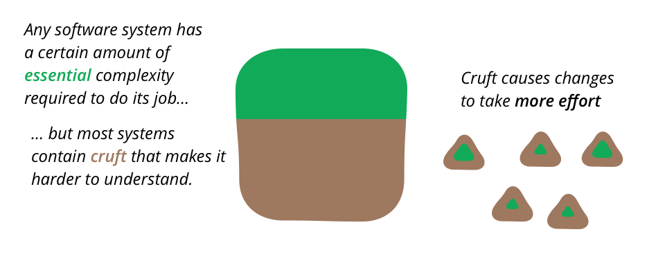

# T13 – Advanced Information Systems testing & maintenance (and Final Retrospective)
## End-to-End & Acceptance tests support

```java
@ExtendWith(SpringExtension.class)
@SpringBootTest(webEnvironment= SpringBootTest.WebEnvironment .RANDOM_PORT) // Configures a random port for the deployment
@DirtiesContext // Forces the re-deployment for each E2E Test
Forces the re-deployment for each E2E Test
public class FullyFledgedUITest {

@LocalServerPort
private int port;
    
...
}
```


## Design for maintenance and code-base health

The journey of software development does not end with the deployment and acceptance of the system.

When adding a new feature you need to know how it fits in the application and understand the existing code.

#### CRUFT

The difference between the current code and how it would ideally be.



https://www.martinfowler.com/bliki/TechnicalDebt.html


https://www.martinfowler.com/articles/is-quality-worth-cost.html

With tools such as *sonarqube*, we can detect CRUFT. https://sonarcloud.io/

https://refactoring.guru/refactoring/techniques


## Final subject retrospective

