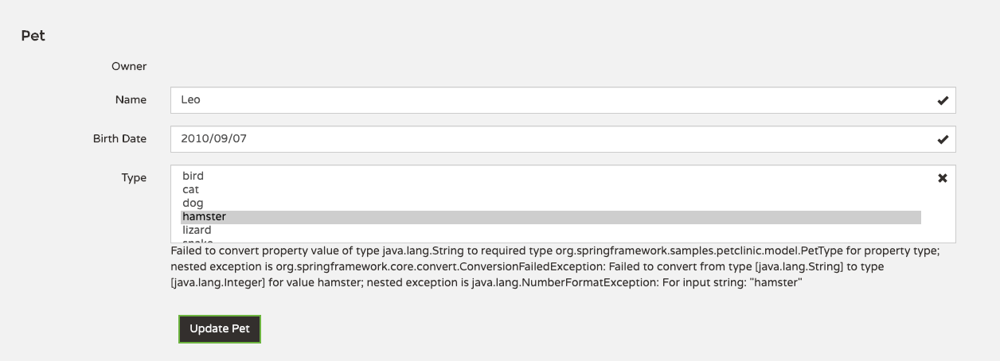
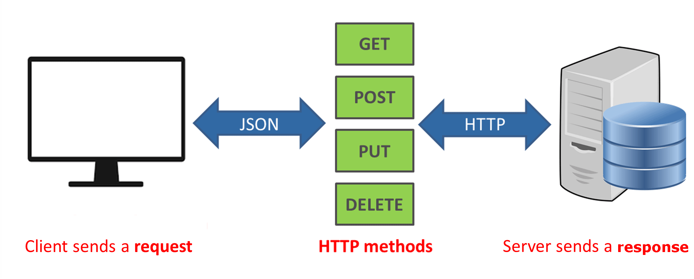
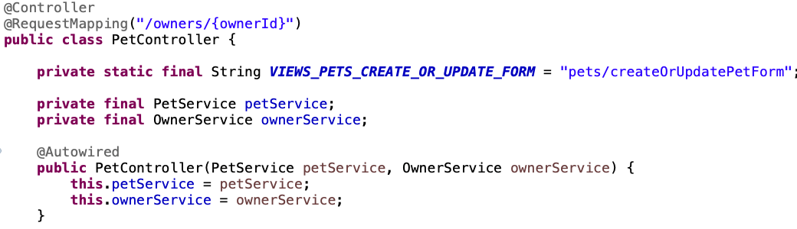
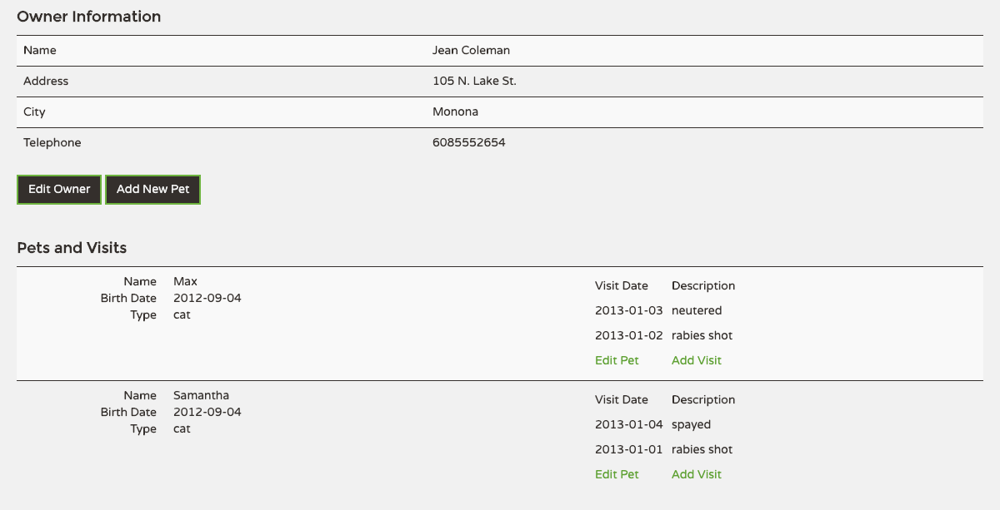
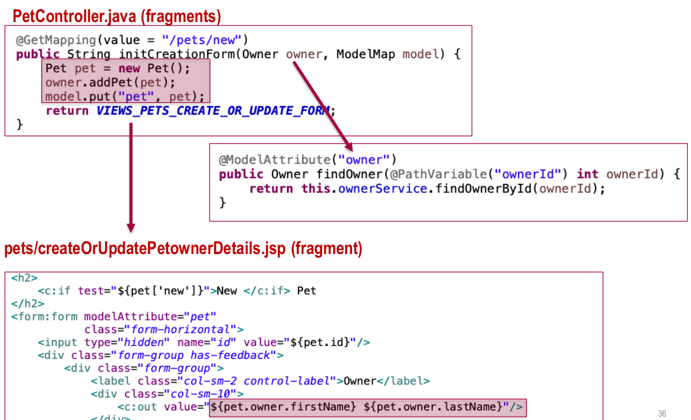

# T8 Introduction to Data Model Design

## Enhancing views
### Working with data from associated entities
The new Pet form is an example in which one of the inputs is an entity stored in the database. In this case is PetType labeled as Type.




The PetType selector requires a converter. Converters allows spring to map each of the PetType names to the corresponding PetType entities stored in the database.

```java
@Component
public class PetTypeFormatter implements Formatter<PetType> {
...
//(Controller -> View) How the entity will be represented in the form 
@Override
public String print(PetType petType, Locale locale) {
	return petType.getName();
}

//(View -> Controller) How are we going to the interpret the string coming from the form
@Override
public PetType parse(String text, Locale locale) throws ParseException {
	Collection<PetType> findPetTypes = this.peService.findPetTypes();
	for (PetType type : findPetTypes) {
		if (type.getName().equals(text))
			return type;
	}
	throw new ParseException("type not found: " + text, 0);
	}
}
```
To inject data from the controllers there are 2 ways of doing it:

#### Inject it directly in the endpoint method

```java
@GetMapping(value = "/pets/new")
public String initCreationForm(Owner owner, ModelMap model) {
	Pet pet = new Pet();
	owner.addPet(pet);
	model.put("pet", pet);
	
	// >>> Inject the list of PetTypes directly
		model.put("types", this.petService.findPetTypes());
		
	return VIEWS_PETS_CREATE_OR_UPDATE_FORM;
}

```
#### Inject it for all endpoints at a controller level

```java
@ModelAttribute("types")
public Collection<PetType> populatePetTypes() {
	return this.petService.findPetTypes();
}
```
### Data binder: Additional options for controllers
The annotation `@InitBinder` is very useful to customize de data that travels from views to controllers. Some of the things we can do are:
* Add custom formatters
* Add custom validators
* Custom editors for certain model attributes

The difference between formatters and editors is that while **formatters convert to the corresponding entity in a straight way**, **editors allows for some manipulation before the conversion** like trim, lowercase, uppercase and so one.

Using this annotation work at a Controller-level so it will work for all methods defined within said controller.

```java
@InitBinder("owner")
public void initOwnerBinder(WebDataBinder dataBinder) {
	dataBinder.setDisallowedFields("id");
}
@InitBinder("pet")
public void initPetBinder(WebDataBinder dataBinder) {
	dataBinder.setValidator(new PetValidator());
}
```

## Implementing REST APIs with Spring
A REST API is a service whose interface is provided by the server using the Representational state transfer architectural style.


### REST APIs, the Spring way
A REST API can be created in Spring using the same Spring MVC approach. We only have to define the controllers that will handle the APIs endpoints as REST controllers.

A `@RestController` works like a regular Spring controller but uses JSON as the codification for objects returned.

```java
@RestController
@RequestMapping("/api/pets")
public class PetRestController {
@Autowired private PetService petService;
...
	@GetMapping
	public Collection<Pet> findAll() {
	return petService.findAllPets();
	}
	@GetMapping("/{id}")
	public Pet findbyId(@PathVariable("id") int id) {
	return petService.findPetById(id);
	}
```
There is not a lot difference for HTTP GET endpoints, **but for operations in which there is a data change it is necessary to be explicit on the HTTP status** that we are returning.

```java
@DeleteMapping("/{id}")
@ResponseStatus(HttpStatus.OK)
public void delete(@PathVariable("id") int id) {
	petService.deletePet(id);
}
```

For PUT endpoints we will receive a JSON. With the `@RequestBody` Spring will automatically do the conversion from JSON to the corresponding entity.

```java
@PutMapping("/{id}")
@ResponseStatus(HttpStatus.OK)
public void update(@RequestBody Pet resource, @PathVariable("id") int id) {
	if(resource == null) {
		throw new BadRequestException();
	} else if(petService.findPetById(id) == null) {
		throw new ResourceNotFoundException();
	} else {
		try {
			petService.savePet(resource);
		} catch (DuplicatedPetNameException ex) {
			throw new BadRequestException();
		}
	}
}
```
### Mapping HTTP error codes
We can use exceptions to map HTTP error codes when something goes wrong.

The `@ResponseStatus(HttpStatus...)` annotation maps the corresponding custom Java Exception with an HTTP response code. This way, when we throw those exceptions in our controllers we return the defined HTTP status code.

```java
@ResponseStatus(HttpStatus.BAD_REQUEST)
public class BadRequestException extends RuntimeException {
}

@ResponseStatus(HttpStatus.NOT_FOUND)
public class ResourceNotFoundException extends RuntimeException {
}
```
Note that this is not necessary when we work with HTML views as we usually can return validation errors and messages. **As REST APIs are plain JSON the only way we can inform of errors is through HTTP error codes**, that we need to explicitly handle.

### Additional warnings/problems regarding JSON serialization
#### Bidirectional associations lead to endless loops.
In case we have a bidirectional relationship, the JSON will represent all nested entities by default. **This will cause a JSON that will nest endlessly**. We need the `@JsonIgnore` in one of the sides of the bidirectional relationship.

```java
@OneToMany(cascade = CascadeType.ALL, mappedBy = "pet")
@JsonIgnore
private Set<Visit> visits;
```
#### The JSON serialization library integrated by Spring Boot do not use the standard converters/formaters

Serialize: Java object -> String (formatted as JSON)
Deserialize: String (formatted as JSON) -> Java object

Implementing serializer/deserializer is not a trivial task and usually you would have to make one for each kind of entity in the system. 

```java
@ManyToOne
@JoinColumn(name = "type_id")
@JsonSerialize(using = PetTypeSerializer.class)
@JsonDeserialize(using = PetTypeDeserializer.class)
private PetType type;
```
Luckily, Prof. Jose Antonio Parejo has implemented a generic JSON serializer/deserializer for all entities that inherit from `BaseEntity`. To use said (de)serializer we use the corresponding annotations:

```java
@JsonSerialize(using = BaseEntitySerializer.class)
@JsonDeserialize(using = BaseEntitySerializer.class)
```

## Error handling
Leaving the default “whitelabel” error handling in Spring is not very professional.

To disable it we have to edit the */petclinic/src/main/resources/ application.properties* file.

```java properties
server.error.whitelabel.enabled=false
```
This way the “whitelabel” error page is no longer displayed and we need to treat errors ourselves.
### Custom error controllers
We have to create a controller implementing the `ErrorController` interface.

The only mandatory method is `getErrorPath`, which states the URL path to call when there is an error in the request. **This is deprecated in newer versions and the `server.error.path` property should be used instead.**

```java
@Controller
public class CustomErrorController implements ErrorController {

@Override
public String getErrorPath() {
	return "/error";
}

@RequestMapping("/error")
public String handleError(HttpServletRequest request) {
	// get error status
	Object status = request.getAttribute(RequestDispatcher.ERROR_STATUS_CODE);
	if (status != null) {
		int statusCode = Integer.parseInt(status.toString());
		// display specific error page
		if (statusCode == HttpStatus.NOT_FOUND.value()) {
			return "error-404";
		} else if (statusCode == 	HttpStatus.INTERNAL_SERVER_ERROR.value()) {
			return "error-500";
		} else if (statusCode == HttpStatus.FORBIDDEN.value()) {
			return "error-403";
		}
	}
	// display generic error
	return "error";
}
```
### Custom error pages
Now we have to create the corresponding JSP views for each different case we defined in the controller.

```jsp
<%@ page session="false" trimDirectiveWhitespaces="true" %>
<%@ taglib prefix="spring" uri="http://www.springframework.org/tags" %>
<%@ taglib prefix="petclinic" tagdir="/WEB-INF/tags" %>
<petclinic:layout pageName="error">
	<spring:url value="/resources/images/pets.png" var="petsImage"/>
	
	<h2>There is no page here!</h2>
	<p>We're sorry, but the page you requested is not available in Petclinic.</p>
</petclinic:layout>
```

## Putting it all together
Taking a look at pets user stories.
*/src/main/java/org/springframework/samples/petclinic/web/ PetController.java* class.


Relies on two services:
* PetService
* OwnerService

As we need the pet owner details in this controller scope, the `ownerId` is included in the path.


When we hit the *Add New Pet* button the model attribute Owner can be automatically retrieved from the method findOwner defined in the controller. The annotation `@ModelAttribute("owner")` tells spring that said method will return the Owner.



